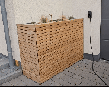
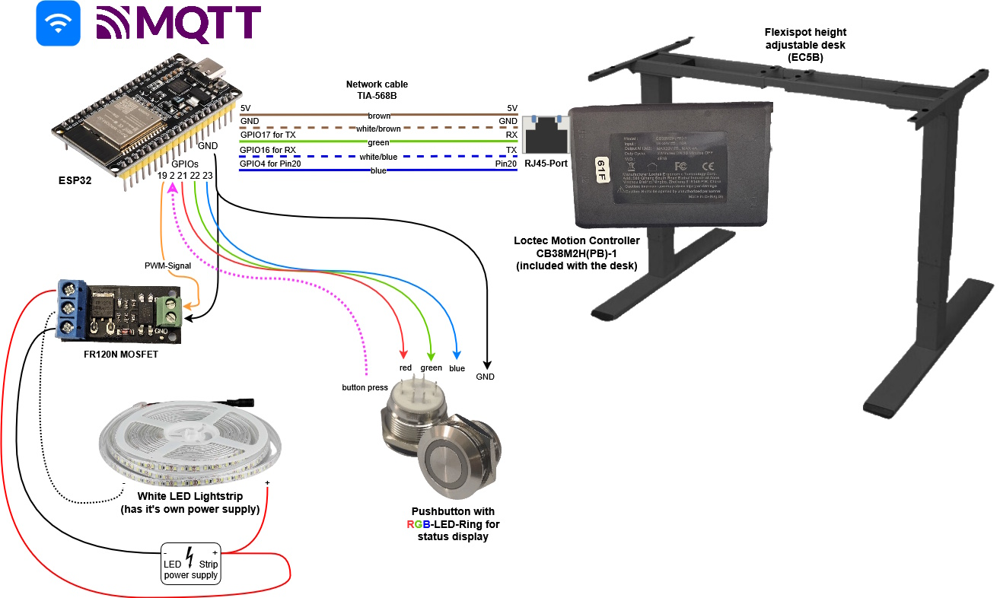

# FlexiBin

## What is FlexiBin?
A smart garbage bin enclosure based on a height-adjustable desk. Controlled locally via push-button or via MQTT with an ESP32.

 

 (timelapse)

## Why?
Because the 3 garbage cans in our front garden had been an eyesore for many years and we now wanted a nice enclosure/covering for them. Last year the time had finally come.
Of course, there are already countless off-the-shelf solutions available for this problem, but none of them are smart. So I thought: "Hey, why not completely over engineer a new solution for that problem?" :wink:

## How it's done?
> [!IMPORTANT]  
> The project is as it is! I have published it in case others find the idea useful and want to replicate it. Unfortunately i don't have the time to respond to feature requests, adapt the code for other hardware variants, handling PRs or for any kind of support. So feel free to do whatever you want with it, fork it, change it according to your ideas, but for me, the project is completed and I want to move on to other things.

I don't want to go into detail here about the construction of the wooden parts, because every situation on site is different and you have to build your own individual box anyway. Just this much: the desk frame is mounted on a raised wooden frame inside the box so that the maximum travel distance of 65 cm can be fully utilized. I use the EC5B frame from Flexispot, most (all?) Flexispot frames use Loctek Motion controllers so other models should also work, but of course I cannot guarantee this. The advantage of the Loctek Motion controllers is that the communication protocol has fortunately already been reverse engineered:
A big thank you to https://github.com/iMicknl/LoctekMotion_IoT and others! The project would not have been possible without their preparatory work.

Beside the desk frame I used the following parts:
- ESP32 microcontroller
- old network cable
- Push button with RGB-LED ring, 19mm, 3-6V (https://de.aliexpress.com/item/1005003538108177.html)
- FR120N MOSFET (https://www.amazon.de/dp/B07HBQZ9BK)
- LED-Strip (I used a 24V variant, but 12V will also work)
- a suitable power supply for the LED-Strip

The following picture shows how all components are wired together:

## What features does Flexibin support?
- Push-Button for local operation
    - toggles between preset 1=closed and preset 2=opened (positions must be saved beforehand via the control panel)
    - when moving, pressing the button stops the movement
    - LED ring indicates the status of the action performed when the button is pressed
        - solid blue: button will open the box
        - solid red: button will close the box
        - flashing red: box is moving, button will stop movement
- LED-Strip support
    - The Led-Strip is activated from an opening height of 95 cm and deactivated again below this height
    - Dimming curve for activation/deactivation
- Control/Status over MQTT

MQTT-Topic | Values | Description
-------- | -------- | -------- 
flexibin/command   | see possible commands below:  | used to trigger a FlexiBin command
|| "preset1" |
|| "preset2" |
|| "preset3" |
|| "preset4" |
|| "wake" |
|| "moveup" |
|| "movedown" |
|| "disableLedStrip" | disable automatic LED strip control, e.g. you may want to prevent the led strip from being switched on in daylight
|| "enableLedStrip" | enable automatic LED strip control
flexibin/position  | float value without unit, e.g. "62.0" | current posision of desk in centimeters
flexibin/lwt  | "Online" or "Offline" | last will and testament, to monitor status of FlexiBin
flexibin/log  | String | last log message, used for debugging

## How to build and flash the project to the ESP32?
### Preparation
Download the FlexiBin.ino project and open it with your Arduino IDE. Adjust the WiFi credentials and MQTT broker credentials. If your GPIO assignment differs from the diagram, please also adjust it accordingly.
### Flashing
Download the board package for ESP32 and build and flash to your ESP32 with Arduino IDE. If you've never done that before, ask any AI (e.g. ChatGPT) of your choice how to do that.
