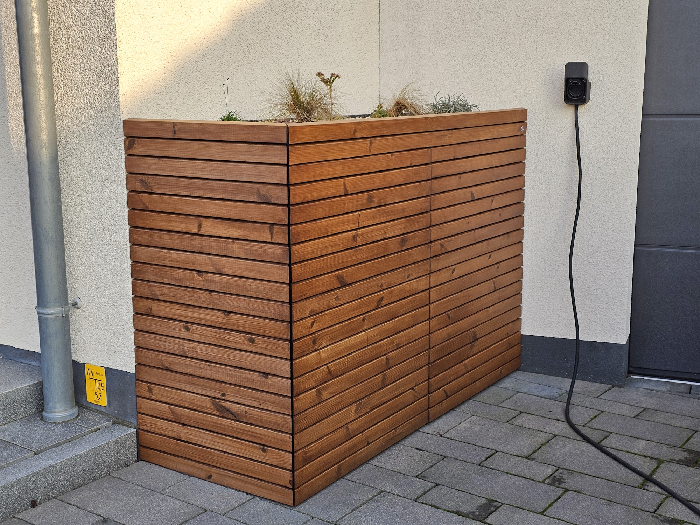
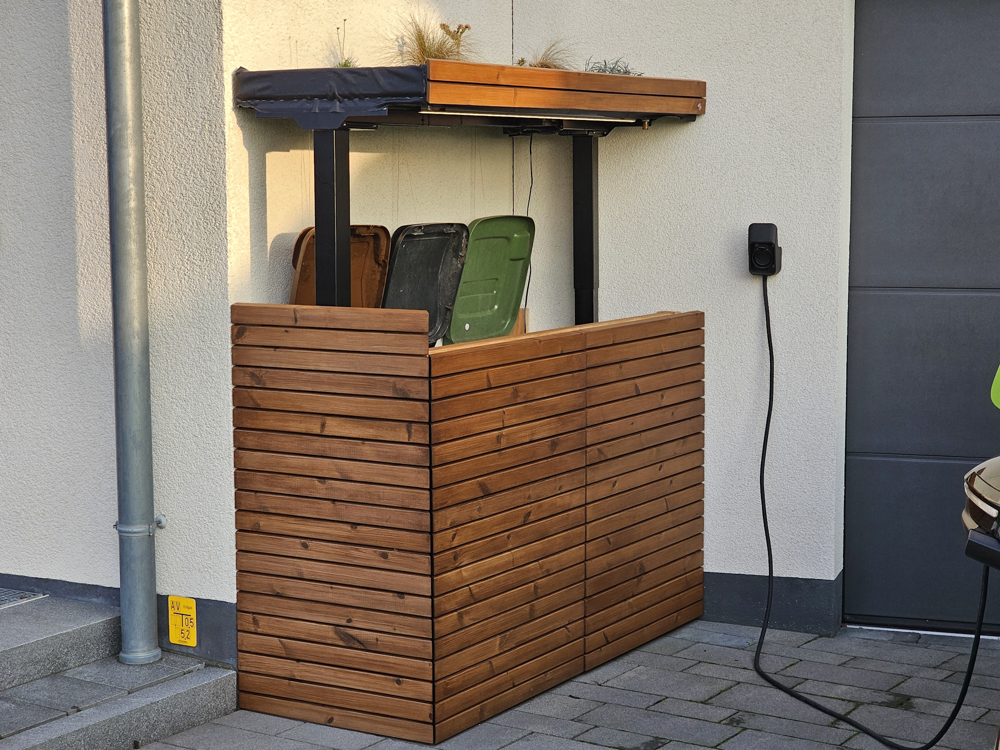

# WasteSpot


## What is WasteSpot?
A smart garbage bin enclosure based on a height-adjustable desk. Controlled locally via push-button or via MQTT with an ESP32.

 


<br>(timelapse)

## Why?
Because the 3 garbage cans in our front garden had been an eyesore for many years and we now wanted a nice enclosure/covering for them. Last year the time had finally come.
Of course, there are already countless off-the-shelf solutions available for this problem, but none of them are smart. So I thought: "Hey, why not completely over engineer a new solution for that problem?" :wink:

## How it's done?
> [!IMPORTANT]  
> The project is as it is! I have published it in case others find the idea useful and want to replicate it. Unfortunately i don't have the time to respond to feature requests, adapt the code for other hardware variants, handling PRs or for any kind of support. So feel free to do whatever you want with it, fork it, change it according to your ideas, but for me, the project is completed and I want to move on to other things.

I don't want to go into detail here about the construction of the wooden parts, because every situation on site is different and you have to build your own individual box anyway. Just this much: the desk frame is mounted on a raised wooden frame inside the box so that the maximum travel distance of 65 cm can be fully utilized. I use the EC5B frame from Flexispot, most (all?) Flexispot frames use Loctek Motion controllers so other models should also work, but of course I cannot guarantee this. The advantage of the Loctek Motion controllers is that the communication protocol has fortunately already been reverse engineered:
A big thank you to https://github.com/iMicknl/LoctekMotion_IoT and others! The project would not have been possible without their preparatory work.

Beside the desk frame I used the following parts:
- ESP32 microcontroller
- old network cable
- Push button with RGB-LED ring, 19mm, 3-6V (https://de.aliexpress.com/item/1005003538108177.html)
- FR120N MOSFET (https://www.amazon.de/dp/B07HBQZ9BK)
- LED-Strip (I used a 24V variant, but 12V will also work)
- a suitable power supply for the LED-Strip

The following picture shows how all components are wired together:


## What features does WasteSpot support?
- Push-Button for local operation
    - toggles between preset 1=closed and preset 2=opened (positions must be saved beforehand via the control panel)
    - when moving, pressing the button stops the movement
    - LED ring indicates the status of the action performed when the button is pressed
        - solid blue: button will open the box
        - solid red: button will close the box
        - flashing red: box is moving, button will stop movement
- LED-Strip support
    - The Led-Strip is activated from an opening height of 95 cm and deactivated again below this height
    - Dimming curve for activation/deactivation
- Control/Status over MQTT

MQTT-Topic | Values | Description
-------- | -------- | -------- 
wastespot/command   | see possible commands below:  | used to trigger a WasteSpot command
|| "preset1" |
|| "preset2" |
|| "preset3" |
|| "preset4" |
|| "wake" |
|| "moveup" |
|| "movedown" |
|| "disableLedStrip" | disable automatic LED strip control, e.g. you may want to prevent the led strip from being switched on in daylight
|| "enableLedStrip" | enable automatic LED strip control
wastespot/position  | float value without unit, e.g. "62.0" | current posision of desk in centimeters
wastespot/lwt  | "Online" or "Offline" | last will and testament, to monitor status of WasteSpot
wastespot/log  | String | last log message, used for debugging

## How to build and flash the project to the ESP32?
### Preparation
Download the WasteSpot.ino project and open it with your Arduino IDE. Adjust your WiFi and MQTT configuration in the file:
```cpp
// WiFi- and MQTT Configuration
const char* wifi_ssid = "******************************";
const char* wifi_password = "******************************";
const char* hostname = "WasteSpot";
const char* mqtt_server = "192.168.x.x";
const int   mqtt_port = 1883;
const char* mqtt_user = "*********************";
const char* mqtt_password = "*********************";
const char* mqtt_topic_command = "wastespot/command";
const char* mqtt_topic_position = "wastespot/position";
const char* mqtt_topic_lwt = "wastespot/lwt"; // last will and testament
const char* mqtt_topic_log = "wastespot/log";
```

If your GPIO assignment differs from the wiring diagram above, please also adjust it accordingly here:

```cpp
//Loctek Motion controller pins
#define displayPin20 4           // RJ45 connector of Loctek Motion controller: Pin20 for power on the desk controller
#define rxPin 16                 // RJ45 connector of Loctek Motion controller: RX-Pin
#define txPin 17                 // RJ45 connector of Loctek Motion controller: TX-Pin

// Other pins
#define togglePresetButtonPin 2  // single toggle button that switches between preset1/preset2
#define ledPinRed 21             // button led ring: red color
#define ledPinGreen 22           // button led ring:  green color
#define ledPinBlue 23            // button led ring:  color
#define ledStripPin 19           // PWM-Signal for LED strip that illuminates the garbage bins (goes into a MOSFET that drives the LED strip)
```

### Flashing
Flashing the ESP32 with the WasteSpot firmware is a straightforward process. Make sure your ESP32 is properly connected to your PC and that the necessary drivers are installed.

#### 1. Requirements
- Install the [Arduino IDE](https://www.arduino.cc/en/software)
- Install the ESP32 board in the Arduino IDE via the Board Manager
- Add the following libraries in the Arduino IDE:
  - `WiFi` (included in the ESP32 core)
  - `PubSubClient` for MQTT support

#### 2. Connect the ESP32 to Your PC
Connect your ESP32 to your computer via USB. Check the assigned COM port in the Device Manager (Windows) or by running:
```sh
ls /dev/tty.*
```
(on Mac/Linux).

#### 3. Compile and Upload
1. Open the `WasteSpot.ino` file in the Arduino IDE.
2. In the Arduino IDE, select your ESP32 model under **Tools → Board**.
3. Select the correct COM port under **Tools → Port**.
4. Click **Upload** to flash the firmware onto the ESP32.

#### 4. Monitor Serial Output
After a successful upload, open the **Serial Monitor** in the Arduino IDE (baud rate: `115200`) to monitor the startup process. Look for messages such as:
```sh
WiFi connected
MQTT connected
```
If you encounter issues:
- Verify the WiFi and MQTT settings in `WasteSpot.ino`.
- Ensure your ESP32 is in the correct boot mode (press and hold the `BOOT` button while flashing if needed).

Once flashing is complete, your WasteSpot is ready to use! 🎉

